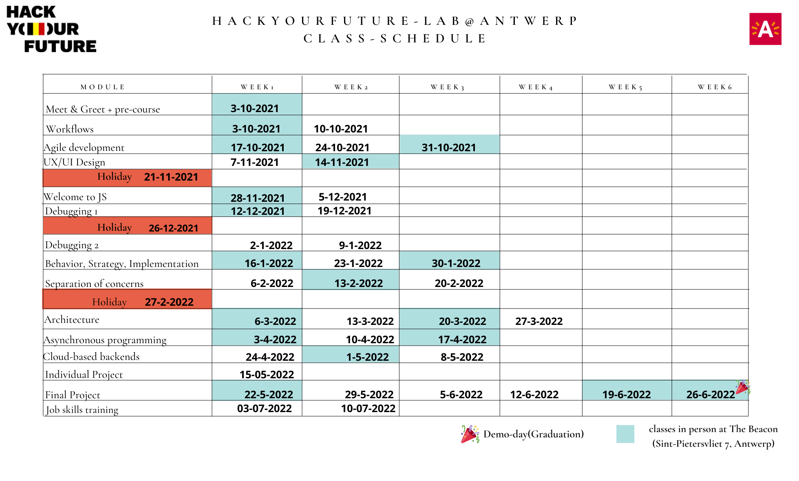

<!-- BEGIN HEADER -->

# Lab Antwerp 1

> - [Issues](https://github.com/lab-antwerp-1/home/issues):
>   [`help-wanted`](https://github.com/lab-antwerp-1/home/issues?q=is%3Aopen+label%3Ahelp%20wanted),
>   [`question`](https://github.com/lab-antwerp-1/home/issues?q=is%3Aopen+label%3Aquestion)
> - [Discussions](https://github.com/lab-antwerp-1/home/discussions/)
> - [Deliverables](https://github.com/lab-antwerp-1/home/projects/1)
> - [Random Groups](https://lab-antwerp-1.github.io/home/randomizer)
> 

> 
Rubber Ducky

>
> 
>
>  

<!-- END HEADER -->

This repository is yours to keep track of what you've covered so far, to get to
know each other, to share helpful resources, to practice collaboration
workflows, ... to do everything!

Slack is great for chatting but links and good explanations can easily get lost
in message history. Think of this repository as your class' forum and home page.

<!-- BEGIN TOC -->

- [Class Calendar](#class-calendar)
- [Modules](#modules)
- [Students](#students)
- [Coaches](#coaches)
- Class Notes
  - [Vocabulary](./vocabulary)
    (_[PRs](https://github.com/lab-antwerp-1/home/pulls?q=label%3Avocabulary)_)
  - [Snippets](./snippets)
    (_[PRs](https://github.com/lab-antwerp-1/home/pulls?q=label%3Asnippets)_)
  - [Chill Zone](./chill-zone)
- HYF Links
  - [Student Guidebook](https://home.hackyourfuture.be/students)
  - [Curriculum](https://home.hackyourfuture.be/curriculum)
  - [Study Book](https://hackyourfuture.github.io/study)
  - [GitHub](https://github.com/hackyourfuturebelgium)
- [Using this Repo](#using-this-repo)

<!-- END TOC -->

---

## Class Calendar

expand/collapse

 

---

## Modules

<!-- BEGIN MODULES -->
  <ol start="1">

<li><h3><a href="https://home.hackyourfuture.be/curriculum/precourse" style="display: inline">precourse</a></h3>  <ul><li>
    0 chapters   | <a href="https://github.com/lab-antwerp-1/home/projects/1?card_filter_query=label%3Adeliverable+milestone%3Aprecourse">deliverables</a>     | <a href="https://github.com/lab-antwerp-1/home/milestone/1">milestone</a> | <a href="https://github.com/HackYourFutureBelgium/precourse">materials</a>  
</li></ul></li>
<li><h3><a href="https://home.hackyourfuture.be/curriculum/workflows" style="display: inline">workflows</a></h3>  <ul><li>
    2 chapters   | <a href="https://github.com/lab-antwerp-1/home/projects/1?card_filter_query=label%3Adeliverable+milestone%3Aworkflows">deliverables</a>    | <a href="https://github.com/lab-antwerp-1/home/issues?q=milestone%3Aworkflows+label%3Acheck-in">check-ins</a>     | <a href="https://github.com/lab-antwerp-1/home/milestone/2">milestone</a> | <a href="https://github.com/HackYourFutureBelgium/workflows">materials</a>  
</li></ul></li>
<li><h3><a href="https://home.hackyourfuture.be/curriculum/agile-development" style="display: inline">agile-development</a></h3>  <ul><li>
    3 chapters   | <a href="https://github.com/lab-antwerp-1/home/projects/1?card_filter_query=label%3Adeliverable+milestone%3Aagile-development">deliverables</a>    | <a href="https://github.com/lab-antwerp-1/home/issues?q=milestone%3Aagile-development+label%3Acheck-in">check-ins</a>     | <a href="https://github.com/lab-antwerp-1/home/milestone/3">milestone</a> | <a href="https://github.com/HackYourFutureBelgium/agile-development">materials</a>  
</li></ul></li>
<li><h3><a href="https://home.hackyourfuture.be/curriculum/ux-ui-design" style="display: inline">ux-ui-design</a></h3>  <ul><li>
    2 chapters   | <a href="https://github.com/lab-antwerp-1/home/projects/1?card_filter_query=label%3Adeliverable+milestone%3Aux-ui-design">deliverables</a>    | <a href="https://github.com/lab-antwerp-1/home/issues?q=milestone%3Aux-ui-design+label%3Acheck-in">check-ins</a>     | <a href="https://github.com/lab-antwerp-1/home/milestone/4">milestone</a> | <a href="https://github.com/HackYourFutureBelgium/ux-ui-design">materials</a>  
</li></ul></li>
<li><h3><a href="https://home.hackyourfuture.be/curriculum/welcome-to-js" style="display: inline">welcome-to-js</a></h3>  <ul><li>
    2 chapters   | <a href="https://github.com/lab-antwerp-1/home/projects/1?card_filter_query=label%3Adeliverable+milestone%3Awelcome-to-js">deliverables</a>    | <a href="https://github.com/lab-antwerp-1/home/issues?q=milestone%3Awelcome-to-js+label%3Acheck-in">check-ins</a>     | <a href="https://github.com/lab-antwerp-1/home/milestone/5">milestone</a> | <a href="https://github.com/HackYourFutureBelgium/welcome-to-js">materials</a>  
</li></ul></li>
<li><h3><a href="https://home.hackyourfuture.be/curriculum/debugging" style="display: inline">debugging</a></h3>  <ul><li>
    4 chapters   | <a href="https://github.com/lab-antwerp-1/home/projects/1?card_filter_query=label%3Adeliverable+milestone%3Adebugging">deliverables</a>    | <a href="https://github.com/lab-antwerp-1/home/issues?q=milestone%3Adebugging+label%3Acheck-in">check-ins</a>     | <a href="https://github.com/lab-antwerp-1/home/milestone/6">milestone</a> | <a href="https://github.com/HackYourFutureBelgium/debugging">materials</a>  
</li></ul></li>
<li><h3><a href="https://home.hackyourfuture.be/curriculum/behavior-strategy-implementation" style="display: inline">behavior-strategy-implementation</a></h3>  <ul><li>
    3 chapters   | <a href="https://github.com/lab-antwerp-1/home/projects/1?card_filter_query=label%3Adeliverable+milestone%3Abehavior-strategy-implementation">deliverables</a>    | <a href="https://github.com/lab-antwerp-1/home/issues?q=milestone%3Abehavior-strategy-implementation+label%3Acheck-in">check-ins</a>     | <a href="https://github.com/lab-antwerp-1/home/milestone/7">milestone</a> | <a href="https://github.com/HackYourFutureBelgium/behavior-strategy-implementation">materials</a>  
</li></ul></li>
<li><h3><a href="https://home.hackyourfuture.be/curriculum/separation-of-concerns" style="display: inline">separation-of-concerns</a></h3>  <ul><li>
    3 chapters   | <a href="https://github.com/lab-antwerp-1/home/projects/1?card_filter_query=label%3Adeliverable+milestone%3Aseparation-of-concerns">deliverables</a>    | <a href="https://github.com/lab-antwerp-1/home/issues?q=milestone%3Aseparation-of-concerns+label%3Acheck-in">check-ins</a>     | <a href="https://github.com/lab-antwerp-1/home/milestone/8">milestone</a> | <a href="https://github.com/HackYourFutureBelgium/separation-of-concerns">materials</a>  
</li></ul></li>
<li><h3><a href="https://home.hackyourfuture.be/curriculum/architecture" style="display: inline">architecture</a></h3>  <ul><li>
    4 chapters   | <a href="https://github.com/lab-antwerp-1/home/projects/1?card_filter_query=label%3Adeliverable+milestone%3Aarchitecture">deliverables</a>    | <a href="https://github.com/lab-antwerp-1/home/issues?q=milestone%3Aarchitecture+label%3Acheck-in">check-ins</a>     | <a href="https://github.com/lab-antwerp-1/home/milestone/9">milestone</a> | <a href="https://github.com/HackYourFutureBelgium/architecture">materials</a>  
</li></ul></li>
<li><h3><a href="https://home.hackyourfuture.be/curriculum/asynchronous-programming" style="display: inline">asynchronous-programming</a></h3>  <ul><li>
    3 chapters   | <a href="https://github.com/lab-antwerp-1/home/projects/1?card_filter_query=label%3Adeliverable+milestone%3Aasynchronous-programming">deliverables</a>    | <a href="https://github.com/lab-antwerp-1/home/issues?q=milestone%3Aasynchronous-programming+label%3Acheck-in">check-ins</a>     | <a href="https://github.com/lab-antwerp-1/home/milestone/10">milestone</a> | <a href="https://github.com/HackYourFutureBelgium/asynchronous-programming">materials</a>  
</li></ul></li>
<li><h3><a href="https://home.hackyourfuture.be/curriculum/cloud-based-backends" style="display: inline">cloud-based-backends</a></h3>  <ul><li>
    3 chapters   | <a href="https://github.com/lab-antwerp-1/home/projects/1?card_filter_query=label%3Adeliverable+milestone%3Acloud-based-backends">deliverables</a>    | <a href="https://github.com/lab-antwerp-1/home/issues?q=milestone%3Acloud-based-backends+label%3Acheck-in">check-ins</a>     | <a href="https://github.com/lab-antwerp-1/home/milestone/11">milestone</a> | <a href="https://github.com/HackYourFutureBelgium/cloud-based-backends">materials</a>  
</li></ul></li>
<li><h3><a href="https://home.hackyourfuture.be/curriculum/final-project" style="display: inline">final-project</a></h3>  <ul><li>
    4 chapters   | <a href="https://github.com/lab-antwerp-1/home/projects/1?card_filter_query=label%3Adeliverable+milestone%3Afinal-project">deliverables</a>    | <a href="https://github.com/lab-antwerp-1/home/issues?q=milestone%3Afinal-project+label%3Acheck-in">check-ins</a>     | <a href="https://github.com/lab-antwerp-1/home/milestone/13">milestone</a> | <a href="https://github.com/HackYourFutureBelgium/final-project">materials</a>  
</li></ul></li>
</ol> 

[TOP](#home)

<!-- END MODULES -->

---

## Students

<!-- BEGIN STUDENTS -->
  <ul  style="list-style-type:none;">

<li><table> <tr>
  <td></td>
  <td> <h3 display="inline">Abdulsamed SAY</h3>
    <ul>
       <li>about: <a href="./student-bios/samedsay.md" target="_blank">bio</a>,      <a href="https://samedsay.github.io">home page</a>, <a href="https://github.com/samedsay">samedsay</a></li>        </li>        <li>HYF: <a href="https://github.com/lab-antwerp-1/home/projects/1?card_filter_query=assignee%3Asamedsay">deliverables</a>, <a href="https://github.com/lab-antwerp-1/home/issues?q=is%3Aissue+author%3Asamedsay+label%3Acheck-in">check-ins</a>, <a href="https://github.com/lab-antwerp-1/home/issues?q=is%3Aissue+commenter%3Asamedsay+label%3Aroll-call">roll-calls</a></li>
        <li>issues: <a href="https://github.com/lab-antwerp-1/home/issues?q=author%3Asamedsay">opened</a>, <a href="https://github.com/lab-antwerp-1/home/issues?q=assignee%3Asamedsay+is%3Aissue">assigned</a>, <a href="https://github.com/lab-antwerp-1/home/issues?q=commenter%3Asamedsay">commented</a></li>
        <li>PRs: <a href="https://github.com/lab-antwerp-1/home/pulls?q=author%3Asamedsay">opened</a>, <a href="https://github.com/lab-antwerp-1/home/pulls?q=assignee%3Asamedsay+is%3Apr">assigned</a>, <a href="https://github.com/lab-antwerp-1/home/pulls?q=commenter%3Asamedsay">commented</a>, <a href="https://github.com/lab-antwerp-1/home/pulls?q=reviewed-by%3Asamedsay+is%3Apr">reviewed</a></li>
       <li>discussions: <a href="https://github.com/lab-antwerp-1/home/discussions?discussions_q=author%3Asamedsay">opened</a>, <a href="https://github.com/lab-antwerp-1/home/discussions?discussions_q=includes%3Asamedsay">included</a></li>       <li>mentions: <a href="https://github.com/lab-antwerp-1/home/issues?q=mentions%3Asamedsay">issues</a>, <a href="https://github.com/lab-antwerp-1/home/pulls?q=mentions%3Asamedsay">PRs</a>, <a href="https://github.com/lab-antwerp-1/home/discussions?discussions_q=mentions%3Asamedsay">discussions</a>
        <li><a href="https://github.com/lab-antwerp-1/samedsay">private repo</a></li>
    </ul>
  </td>
</tr></table> </li>
<li><table> <tr>
  <td></td>
  <td> <h3 display="inline">Afruzul haq RUPAM</h3>
    <ul>
       <li>about: <a href="./student-bios/Rphoof.md" target="_blank">bio</a>,      <a href="https://Rphoof.github.io">home page</a>, <a href="https://github.com/Rphoof">Rphoof</a></li>        </li>        <li>HYF: <a href="https://github.com/lab-antwerp-1/home/projects/1?card_filter_query=assignee%3ARphoof">deliverables</a>, <a href="https://github.com/lab-antwerp-1/home/issues?q=is%3Aissue+author%3ARphoof+label%3Acheck-in">check-ins</a>, <a href="https://github.com/lab-antwerp-1/home/issues?q=is%3Aissue+commenter%3ARphoof+label%3Aroll-call">roll-calls</a></li>
        <li>issues: <a href="https://github.com/lab-antwerp-1/home/issues?q=author%3ARphoof">opened</a>, <a href="https://github.com/lab-antwerp-1/home/issues?q=assignee%3ARphoof+is%3Aissue">assigned</a>, <a href="https://github.com/lab-antwerp-1/home/issues?q=commenter%3ARphoof">commented</a></li>
        <li>PRs: <a href="https://github.com/lab-antwerp-1/home/pulls?q=author%3ARphoof">opened</a>, <a href="https://github.com/lab-antwerp-1/home/pulls?q=assignee%3ARphoof+is%3Apr">assigned</a>, <a href="https://github.com/lab-antwerp-1/home/pulls?q=commenter%3ARphoof">commented</a>, <a href="https://github.com/lab-antwerp-1/home/pulls?q=reviewed-by%3ARphoof+is%3Apr">reviewed</a></li>
       <li>discussions: <a href="https://github.com/lab-antwerp-1/home/discussions?discussions_q=author%3ARphoof">opened</a>, <a href="https://github.com/lab-antwerp-1/home/discussions?discussions_q=includes%3ARphoof">included</a></li>       <li>mentions: <a href="https://github.com/lab-antwerp-1/home/issues?q=mentions%3ARphoof">issues</a>, <a href="https://github.com/lab-antwerp-1/home/pulls?q=mentions%3ARphoof">PRs</a>, <a href="https://github.com/lab-antwerp-1/home/discussions?discussions_q=mentions%3ARphoof">discussions</a>
        <li><a href="https://github.com/lab-antwerp-1/Rphoof">private repo</a></li>
    </ul>
  </td>
</tr></table> </li>
<li><table> <tr>
  <td></td>
  <td> <h3 display="inline">Ahmed Nasserallah</h3>
    <ul>
       <li>about: <a href="./student-bios/Ahmed-nasserallah.md" target="_blank">bio</a>,      <a href="https://Ahmed-nasserallah.github.io">home page</a>, <a href="https://github.com/Ahmed-nasserallah">Ahmed-nasserallah</a></li>        </li>        <li>HYF: <a href="https://github.com/lab-antwerp-1/home/projects/1?card_filter_query=assignee%3AAhmed-nasserallah">deliverables</a>, <a href="https://github.com/lab-antwerp-1/home/issues?q=is%3Aissue+author%3AAhmed-nasserallah+label%3Acheck-in">check-ins</a>, <a href="https://github.com/lab-antwerp-1/home/issues?q=is%3Aissue+commenter%3AAhmed-nasserallah+label%3Aroll-call">roll-calls</a></li>
        <li>issues: <a href="https://github.com/lab-antwerp-1/home/issues?q=author%3AAhmed-nasserallah">opened</a>, <a href="https://github.com/lab-antwerp-1/home/issues?q=assignee%3AAhmed-nasserallah+is%3Aissue">assigned</a>, <a href="https://github.com/lab-antwerp-1/home/issues?q=commenter%3AAhmed-nasserallah">commented</a></li>
        <li>PRs: <a href="https://github.com/lab-antwerp-1/home/pulls?q=author%3AAhmed-nasserallah">opened</a>, <a href="https://github.com/lab-antwerp-1/home/pulls?q=assignee%3AAhmed-nasserallah+is%3Apr">assigned</a>, <a href="https://github.com/lab-antwerp-1/home/pulls?q=commenter%3AAhmed-nasserallah">commented</a>, <a href="https://github.com/lab-antwerp-1/home/pulls?q=reviewed-by%3AAhmed-nasserallah+is%3Apr">reviewed</a></li>
       <li>discussions: <a href="https://github.com/lab-antwerp-1/home/discussions?discussions_q=author%3AAhmed-nasserallah">opened</a>, <a href="https://github.com/lab-antwerp-1/home/discussions?discussions_q=includes%3AAhmed-nasserallah">included</a></li>       <li>mentions: <a href="https://github.com/lab-antwerp-1/home/issues?q=mentions%3AAhmed-nasserallah">issues</a>, <a href="https://github.com/lab-antwerp-1/home/pulls?q=mentions%3AAhmed-nasserallah">PRs</a>, <a href="https://github.com/lab-antwerp-1/home/discussions?discussions_q=mentions%3AAhmed-nasserallah">discussions</a>
        <li><a href="https://github.com/lab-antwerp-1/Ahmed-nasserallah">private repo</a></li>
    </ul>
  </td>
</tr></table> </li>
<li><table> <tr>
  <td></td>
  <td> <h3 display="inline">Ashenafi Weldie</h3>
    <ul>
       <li>about: <a href="./student-bios/ashenafykebede.md" target="_blank">bio</a>,      <a href="https://ashenafykebede.github.io">home page</a>, <a href="https://github.com/ashenafykebede">ashenafykebede</a></li>        </li>        <li>HYF: <a href="https://github.com/lab-antwerp-1/home/projects/1?card_filter_query=assignee%3Aashenafykebede">deliverables</a>, <a href="https://github.com/lab-antwerp-1/home/issues?q=is%3Aissue+author%3Aashenafykebede+label%3Acheck-in">check-ins</a>, <a href="https://github.com/lab-antwerp-1/home/issues?q=is%3Aissue+commenter%3Aashenafykebede+label%3Aroll-call">roll-calls</a></li>
        <li>issues: <a href="https://github.com/lab-antwerp-1/home/issues?q=author%3Aashenafykebede">opened</a>, <a href="https://github.com/lab-antwerp-1/home/issues?q=assignee%3Aashenafykebede+is%3Aissue">assigned</a>, <a href="https://github.com/lab-antwerp-1/home/issues?q=commenter%3Aashenafykebede">commented</a></li>
        <li>PRs: <a href="https://github.com/lab-antwerp-1/home/pulls?q=author%3Aashenafykebede">opened</a>, <a href="https://github.com/lab-antwerp-1/home/pulls?q=assignee%3Aashenafykebede+is%3Apr">assigned</a>, <a href="https://github.com/lab-antwerp-1/home/pulls?q=commenter%3Aashenafykebede">commented</a>, <a href="https://github.com/lab-antwerp-1/home/pulls?q=reviewed-by%3Aashenafykebede+is%3Apr">reviewed</a></li>
       <li>discussions: <a href="https://github.com/lab-antwerp-1/home/discussions?discussions_q=author%3Aashenafykebede">opened</a>, <a href="https://github.com/lab-antwerp-1/home/discussions?discussions_q=includes%3Aashenafykebede">included</a></li>       <li>mentions: <a href="https://github.com/lab-antwerp-1/home/issues?q=mentions%3Aashenafykebede">issues</a>, <a href="https://github.com/lab-antwerp-1/home/pulls?q=mentions%3Aashenafykebede">PRs</a>, <a href="https://github.com/lab-antwerp-1/home/discussions?discussions_q=mentions%3Aashenafykebede">discussions</a>
        <li><a href="https://github.com/lab-antwerp-1/ashenafykebede">private repo</a></li>
    </ul>
  </td>
</tr></table> </li>
<li><table> <tr>
  <td></td>
  <td> <h3 display="inline">Aviv Dror</h3>
    <ul>
       <li>about: <a href="./student-bios/aviv82.md" target="_blank">bio</a>,      <a href="https://aviv82.github.io">home page</a>, <a href="https://github.com/aviv82">aviv82</a></li>        </li>        <li>HYF: <a href="https://github.com/lab-antwerp-1/home/projects/1?card_filter_query=assignee%3Aaviv82">deliverables</a>, <a href="https://github.com/lab-antwerp-1/home/issues?q=is%3Aissue+author%3Aaviv82+label%3Acheck-in">check-ins</a>, <a href="https://github.com/lab-antwerp-1/home/issues?q=is%3Aissue+commenter%3Aaviv82+label%3Aroll-call">roll-calls</a></li>
        <li>issues: <a href="https://github.com/lab-antwerp-1/home/issues?q=author%3Aaviv82">opened</a>, <a href="https://github.com/lab-antwerp-1/home/issues?q=assignee%3Aaviv82+is%3Aissue">assigned</a>, <a href="https://github.com/lab-antwerp-1/home/issues?q=commenter%3Aaviv82">commented</a></li>
        <li>PRs: <a href="https://github.com/lab-antwerp-1/home/pulls?q=author%3Aaviv82">opened</a>, <a href="https://github.com/lab-antwerp-1/home/pulls?q=assignee%3Aaviv82+is%3Apr">assigned</a>, <a href="https://github.com/lab-antwerp-1/home/pulls?q=commenter%3Aaviv82">commented</a>, <a href="https://github.com/lab-antwerp-1/home/pulls?q=reviewed-by%3Aaviv82+is%3Apr">reviewed</a></li>
       <li>discussions: <a href="https://github.com/lab-antwerp-1/home/discussions?discussions_q=author%3Aaviv82">opened</a>, <a href="https://github.com/lab-antwerp-1/home/discussions?discussions_q=includes%3Aaviv82">included</a></li>       <li>mentions: <a href="https://github.com/lab-antwerp-1/home/issues?q=mentions%3Aaviv82">issues</a>, <a href="https://github.com/lab-antwerp-1/home/pulls?q=mentions%3Aaviv82">PRs</a>, <a href="https://github.com/lab-antwerp-1/home/discussions?discussions_q=mentions%3Aaviv82">discussions</a>
        <li><a href="https://github.com/lab-antwerp-1/aviv82">private repo</a></li>
    </ul>
  </td>
</tr></table> </li>
<li><table> <tr>
  <td></td>
  <td> <h3 display="inline">Daniel Álvarez</h3>
    <ul>
       <li>about: <a href="./student-bios/denrique-alvarez.md" target="_blank">bio</a>,      <a href="https://denrique-alvarez.github.io">home page</a>, <a href="https://github.com/denrique-alvarez">denrique-alvarez</a></li>        </li>        <li>HYF: <a href="https://github.com/lab-antwerp-1/home/projects/1?card_filter_query=assignee%3Adenrique-alvarez">deliverables</a>, <a href="https://github.com/lab-antwerp-1/home/issues?q=is%3Aissue+author%3Adenrique-alvarez+label%3Acheck-in">check-ins</a>, <a href="https://github.com/lab-antwerp-1/home/issues?q=is%3Aissue+commenter%3Adenrique-alvarez+label%3Aroll-call">roll-calls</a></li>
        <li>issues: <a href="https://github.com/lab-antwerp-1/home/issues?q=author%3Adenrique-alvarez">opened</a>, <a href="https://github.com/lab-antwerp-1/home/issues?q=assignee%3Adenrique-alvarez+is%3Aissue">assigned</a>, <a href="https://github.com/lab-antwerp-1/home/issues?q=commenter%3Adenrique-alvarez">commented</a></li>
        <li>PRs: <a href="https://github.com/lab-antwerp-1/home/pulls?q=author%3Adenrique-alvarez">opened</a>, <a href="https://github.com/lab-antwerp-1/home/pulls?q=assignee%3Adenrique-alvarez+is%3Apr">assigned</a>, <a href="https://github.com/lab-antwerp-1/home/pulls?q=commenter%3Adenrique-alvarez">commented</a>, <a href="https://github.com/lab-antwerp-1/home/pulls?q=reviewed-by%3Adenrique-alvarez+is%3Apr">reviewed</a></li>
       <li>discussions: <a href="https://github.com/lab-antwerp-1/home/discussions?discussions_q=author%3Adenrique-alvarez">opened</a>, <a href="https://github.com/lab-antwerp-1/home/discussions?discussions_q=includes%3Adenrique-alvarez">included</a></li>       <li>mentions: <a href="https://github.com/lab-antwerp-1/home/issues?q=mentions%3Adenrique-alvarez">issues</a>, <a href="https://github.com/lab-antwerp-1/home/pulls?q=mentions%3Adenrique-alvarez">PRs</a>, <a href="https://github.com/lab-antwerp-1/home/discussions?discussions_q=mentions%3Adenrique-alvarez">discussions</a>
        <li><a href="https://github.com/lab-antwerp-1/denrique-alvarez">private repo</a></li>
    </ul>
  </td>
</tr></table> </li>
<li><table> <tr>
  <td></td>
  <td> <h3 display="inline">Darin Hamouda</h3>
    <ul>
       <li>about: <a href="./student-bios/Darin-Hamouda.md" target="_blank">bio</a>,      <a href="https://Darin-Hamouda.github.io">home page</a>, <a href="https://github.com/Darin-Hamouda">Darin-Hamouda</a></li>        </li>        <li>HYF: <a href="https://github.com/lab-antwerp-1/home/projects/1?card_filter_query=assignee%3ADarin-Hamouda">deliverables</a>, <a href="https://github.com/lab-antwerp-1/home/issues?q=is%3Aissue+author%3ADarin-Hamouda+label%3Acheck-in">check-ins</a>, <a href="https://github.com/lab-antwerp-1/home/issues?q=is%3Aissue+commenter%3ADarin-Hamouda+label%3Aroll-call">roll-calls</a></li>
        <li>issues: <a href="https://github.com/lab-antwerp-1/home/issues?q=author%3ADarin-Hamouda">opened</a>, <a href="https://github.com/lab-antwerp-1/home/issues?q=assignee%3ADarin-Hamouda+is%3Aissue">assigned</a>, <a href="https://github.com/lab-antwerp-1/home/issues?q=commenter%3ADarin-Hamouda">commented</a></li>
        <li>PRs: <a href="https://github.com/lab-antwerp-1/home/pulls?q=author%3ADarin-Hamouda">opened</a>, <a href="https://github.com/lab-antwerp-1/home/pulls?q=assignee%3ADarin-Hamouda+is%3Apr">assigned</a>, <a href="https://github.com/lab-antwerp-1/home/pulls?q=commenter%3ADarin-Hamouda">commented</a>, <a href="https://github.com/lab-antwerp-1/home/pulls?q=reviewed-by%3ADarin-Hamouda+is%3Apr">reviewed</a></li>
       <li>discussions: <a href="https://github.com/lab-antwerp-1/home/discussions?discussions_q=author%3ADarin-Hamouda">opened</a>, <a href="https://github.com/lab-antwerp-1/home/discussions?discussions_q=includes%3ADarin-Hamouda">included</a></li>       <li>mentions: <a href="https://github.com/lab-antwerp-1/home/issues?q=mentions%3ADarin-Hamouda">issues</a>, <a href="https://github.com/lab-antwerp-1/home/pulls?q=mentions%3ADarin-Hamouda">PRs</a>, <a href="https://github.com/lab-antwerp-1/home/discussions?discussions_q=mentions%3ADarin-Hamouda">discussions</a>
        <li><a href="https://github.com/lab-antwerp-1/Darin-Hamouda">private repo</a></li>
    </ul>
  </td>
</tr></table> </li>
<li><table> <tr>
  <td></td>
  <td> <h3 display="inline">Dawit Netsereab</h3>
    <ul>
       <li>about: <a href="./student-bios/dawit263.md" target="_blank">bio</a>,      <a href="https://dawit263.github.io">home page</a>, <a href="https://github.com/dawit263">dawit263</a></li>        </li>        <li>HYF: <a href="https://github.com/lab-antwerp-1/home/projects/1?card_filter_query=assignee%3Adawit263">deliverables</a>, <a href="https://github.com/lab-antwerp-1/home/issues?q=is%3Aissue+author%3Adawit263+label%3Acheck-in">check-ins</a>, <a href="https://github.com/lab-antwerp-1/home/issues?q=is%3Aissue+commenter%3Adawit263+label%3Aroll-call">roll-calls</a></li>
        <li>issues: <a href="https://github.com/lab-antwerp-1/home/issues?q=author%3Adawit263">opened</a>, <a href="https://github.com/lab-antwerp-1/home/issues?q=assignee%3Adawit263+is%3Aissue">assigned</a>, <a href="https://github.com/lab-antwerp-1/home/issues?q=commenter%3Adawit263">commented</a></li>
        <li>PRs: <a href="https://github.com/lab-antwerp-1/home/pulls?q=author%3Adawit263">opened</a>, <a href="https://github.com/lab-antwerp-1/home/pulls?q=assignee%3Adawit263+is%3Apr">assigned</a>, <a href="https://github.com/lab-antwerp-1/home/pulls?q=commenter%3Adawit263">commented</a>, <a href="https://github.com/lab-antwerp-1/home/pulls?q=reviewed-by%3Adawit263+is%3Apr">reviewed</a></li>
       <li>discussions: <a href="https://github.com/lab-antwerp-1/home/discussions?discussions_q=author%3Adawit263">opened</a>, <a href="https://github.com/lab-antwerp-1/home/discussions?discussions_q=includes%3Adawit263">included</a></li>       <li>mentions: <a href="https://github.com/lab-antwerp-1/home/issues?q=mentions%3Adawit263">issues</a>, <a href="https://github.com/lab-antwerp-1/home/pulls?q=mentions%3Adawit263">PRs</a>, <a href="https://github.com/lab-antwerp-1/home/discussions?discussions_q=mentions%3Adawit263">discussions</a>
        <li><a href="https://github.com/lab-antwerp-1/dawit263">private repo</a></li>
    </ul>
  </td>
</tr></table> </li>
<li><table> <tr>
  <td></td>
  <td> <h3 display="inline">Eduardo Alfaro Bautista</h3>
    <ul>
       <li>about: <a href="./student-bios/edualfaro.md" target="_blank">bio</a>,      <a href="https://edualfaro.github.io">home page</a>, <a href="https://github.com/edualfaro">edualfaro</a></li>        </li>        <li>HYF: <a href="https://github.com/lab-antwerp-1/home/projects/1?card_filter_query=assignee%3Aedualfaro">deliverables</a>, <a href="https://github.com/lab-antwerp-1/home/issues?q=is%3Aissue+author%3Aedualfaro+label%3Acheck-in">check-ins</a>, <a href="https://github.com/lab-antwerp-1/home/issues?q=is%3Aissue+commenter%3Aedualfaro+label%3Aroll-call">roll-calls</a></li>
        <li>issues: <a href="https://github.com/lab-antwerp-1/home/issues?q=author%3Aedualfaro">opened</a>, <a href="https://github.com/lab-antwerp-1/home/issues?q=assignee%3Aedualfaro+is%3Aissue">assigned</a>, <a href="https://github.com/lab-antwerp-1/home/issues?q=commenter%3Aedualfaro">commented</a></li>
        <li>PRs: <a href="https://github.com/lab-antwerp-1/home/pulls?q=author%3Aedualfaro">opened</a>, <a href="https://github.com/lab-antwerp-1/home/pulls?q=assignee%3Aedualfaro+is%3Apr">assigned</a>, <a href="https://github.com/lab-antwerp-1/home/pulls?q=commenter%3Aedualfaro">commented</a>, <a href="https://github.com/lab-antwerp-1/home/pulls?q=reviewed-by%3Aedualfaro+is%3Apr">reviewed</a></li>
       <li>discussions: <a href="https://github.com/lab-antwerp-1/home/discussions?discussions_q=author%3Aedualfaro">opened</a>, <a href="https://github.com/lab-antwerp-1/home/discussions?discussions_q=includes%3Aedualfaro">included</a></li>       <li>mentions: <a href="https://github.com/lab-antwerp-1/home/issues?q=mentions%3Aedualfaro">issues</a>, <a href="https://github.com/lab-antwerp-1/home/pulls?q=mentions%3Aedualfaro">PRs</a>, <a href="https://github.com/lab-antwerp-1/home/discussions?discussions_q=mentions%3Aedualfaro">discussions</a>
        <li><a href="https://github.com/lab-antwerp-1/edualfaro">private repo</a></li>
    </ul>
  </td>
</tr></table> </li>
<li><table> <tr>
  <td></td>
  <td> <h3 display="inline">Khaled Saada</h3>
    <ul>
       <li>about: <a href="./student-bios/Levaii.md" target="_blank">bio</a>,      <a href="https://Levaii.github.io">home page</a>, <a href="https://github.com/Levaii">Levaii</a></li>        </li>        <li>HYF: <a href="https://github.com/lab-antwerp-1/home/projects/1?card_filter_query=assignee%3ALevaii">deliverables</a>, <a href="https://github.com/lab-antwerp-1/home/issues?q=is%3Aissue+author%3ALevaii+label%3Acheck-in">check-ins</a>, <a href="https://github.com/lab-antwerp-1/home/issues?q=is%3Aissue+commenter%3ALevaii+label%3Aroll-call">roll-calls</a></li>
        <li>issues: <a href="https://github.com/lab-antwerp-1/home/issues?q=author%3ALevaii">opened</a>, <a href="https://github.com/lab-antwerp-1/home/issues?q=assignee%3ALevaii+is%3Aissue">assigned</a>, <a href="https://github.com/lab-antwerp-1/home/issues?q=commenter%3ALevaii">commented</a></li>
        <li>PRs: <a href="https://github.com/lab-antwerp-1/home/pulls?q=author%3ALevaii">opened</a>, <a href="https://github.com/lab-antwerp-1/home/pulls?q=assignee%3ALevaii+is%3Apr">assigned</a>, <a href="https://github.com/lab-antwerp-1/home/pulls?q=commenter%3ALevaii">commented</a>, <a href="https://github.com/lab-antwerp-1/home/pulls?q=reviewed-by%3ALevaii+is%3Apr">reviewed</a></li>
       <li>discussions: <a href="https://github.com/lab-antwerp-1/home/discussions?discussions_q=author%3ALevaii">opened</a>, <a href="https://github.com/lab-antwerp-1/home/discussions?discussions_q=includes%3ALevaii">included</a></li>       <li>mentions: <a href="https://github.com/lab-antwerp-1/home/issues?q=mentions%3ALevaii">issues</a>, <a href="https://github.com/lab-antwerp-1/home/pulls?q=mentions%3ALevaii">PRs</a>, <a href="https://github.com/lab-antwerp-1/home/discussions?discussions_q=mentions%3ALevaii">discussions</a>
        <li><a href="https://github.com/lab-antwerp-1/Levaii">private repo</a></li>
    </ul>
  </td>
</tr></table> </li>
<li><table> <tr>
  <td></td>
  <td> <h3 display="inline">Mahmoud Abu Azoum</h3>
    <ul>
       <li>about: <a href="./student-bios/krakla.md" target="_blank">bio</a>,      <a href="https://krakla.github.io">home page</a>, <a href="https://github.com/krakla">krakla</a></li>        </li>        <li>HYF: <a href="https://github.com/lab-antwerp-1/home/projects/1?card_filter_query=assignee%3Akrakla">deliverables</a>, <a href="https://github.com/lab-antwerp-1/home/issues?q=is%3Aissue+author%3Akrakla+label%3Acheck-in">check-ins</a>, <a href="https://github.com/lab-antwerp-1/home/issues?q=is%3Aissue+commenter%3Akrakla+label%3Aroll-call">roll-calls</a></li>
        <li>issues: <a href="https://github.com/lab-antwerp-1/home/issues?q=author%3Akrakla">opened</a>, <a href="https://github.com/lab-antwerp-1/home/issues?q=assignee%3Akrakla+is%3Aissue">assigned</a>, <a href="https://github.com/lab-antwerp-1/home/issues?q=commenter%3Akrakla">commented</a></li>
        <li>PRs: <a href="https://github.com/lab-antwerp-1/home/pulls?q=author%3Akrakla">opened</a>, <a href="https://github.com/lab-antwerp-1/home/pulls?q=assignee%3Akrakla+is%3Apr">assigned</a>, <a href="https://github.com/lab-antwerp-1/home/pulls?q=commenter%3Akrakla">commented</a>, <a href="https://github.com/lab-antwerp-1/home/pulls?q=reviewed-by%3Akrakla+is%3Apr">reviewed</a></li>
       <li>discussions: <a href="https://github.com/lab-antwerp-1/home/discussions?discussions_q=author%3Akrakla">opened</a>, <a href="https://github.com/lab-antwerp-1/home/discussions?discussions_q=includes%3Akrakla">included</a></li>       <li>mentions: <a href="https://github.com/lab-antwerp-1/home/issues?q=mentions%3Akrakla">issues</a>, <a href="https://github.com/lab-antwerp-1/home/pulls?q=mentions%3Akrakla">PRs</a>, <a href="https://github.com/lab-antwerp-1/home/discussions?discussions_q=mentions%3Akrakla">discussions</a>
        <li><a href="https://github.com/lab-antwerp-1/krakla">private repo</a></li>
    </ul>
  </td>
</tr></table> </li>
<li><table> <tr>
  <td></td>
  <td> <h3 display="inline">Maurice Mateke</h3>
    <ul>
       <li>about: <a href="./student-bios/mauricemat.md" target="_blank">bio</a>,      <a href="https://mauricemat.github.io">home page</a>, <a href="https://github.com/mauricemat">mauricemat</a></li>        </li>        <li>HYF: <a href="https://github.com/lab-antwerp-1/home/projects/1?card_filter_query=assignee%3Amauricemat">deliverables</a>, <a href="https://github.com/lab-antwerp-1/home/issues?q=is%3Aissue+author%3Amauricemat+label%3Acheck-in">check-ins</a>, <a href="https://github.com/lab-antwerp-1/home/issues?q=is%3Aissue+commenter%3Amauricemat+label%3Aroll-call">roll-calls</a></li>
        <li>issues: <a href="https://github.com/lab-antwerp-1/home/issues?q=author%3Amauricemat">opened</a>, <a href="https://github.com/lab-antwerp-1/home/issues?q=assignee%3Amauricemat+is%3Aissue">assigned</a>, <a href="https://github.com/lab-antwerp-1/home/issues?q=commenter%3Amauricemat">commented</a></li>
        <li>PRs: <a href="https://github.com/lab-antwerp-1/home/pulls?q=author%3Amauricemat">opened</a>, <a href="https://github.com/lab-antwerp-1/home/pulls?q=assignee%3Amauricemat+is%3Apr">assigned</a>, <a href="https://github.com/lab-antwerp-1/home/pulls?q=commenter%3Amauricemat">commented</a>, <a href="https://github.com/lab-antwerp-1/home/pulls?q=reviewed-by%3Amauricemat+is%3Apr">reviewed</a></li>
       <li>discussions: <a href="https://github.com/lab-antwerp-1/home/discussions?discussions_q=author%3Amauricemat">opened</a>, <a href="https://github.com/lab-antwerp-1/home/discussions?discussions_q=includes%3Amauricemat">included</a></li>       <li>mentions: <a href="https://github.com/lab-antwerp-1/home/issues?q=mentions%3Amauricemat">issues</a>, <a href="https://github.com/lab-antwerp-1/home/pulls?q=mentions%3Amauricemat">PRs</a>, <a href="https://github.com/lab-antwerp-1/home/discussions?discussions_q=mentions%3Amauricemat">discussions</a>
        <li><a href="https://github.com/lab-antwerp-1/mauricemat">private repo</a></li>
    </ul>
  </td>
</tr></table> </li>
<li><table> <tr>
  <td></td>
  <td> <h3 display="inline">Mervat Abuamro</h3>
    <ul>
       <li>about: <a href="./student-bios/Mervatabuamro.md" target="_blank">bio</a>,      <a href="https://Mervatabuamro.github.io">home page</a>, <a href="https://github.com/Mervatabuamro">Mervatabuamro</a></li>        </li>        <li>HYF: <a href="https://github.com/lab-antwerp-1/home/projects/1?card_filter_query=assignee%3AMervatabuamro">deliverables</a>, <a href="https://github.com/lab-antwerp-1/home/issues?q=is%3Aissue+author%3AMervatabuamro+label%3Acheck-in">check-ins</a>, <a href="https://github.com/lab-antwerp-1/home/issues?q=is%3Aissue+commenter%3AMervatabuamro+label%3Aroll-call">roll-calls</a></li>
        <li>issues: <a href="https://github.com/lab-antwerp-1/home/issues?q=author%3AMervatabuamro">opened</a>, <a href="https://github.com/lab-antwerp-1/home/issues?q=assignee%3AMervatabuamro+is%3Aissue">assigned</a>, <a href="https://github.com/lab-antwerp-1/home/issues?q=commenter%3AMervatabuamro">commented</a></li>
        <li>PRs: <a href="https://github.com/lab-antwerp-1/home/pulls?q=author%3AMervatabuamro">opened</a>, <a href="https://github.com/lab-antwerp-1/home/pulls?q=assignee%3AMervatabuamro+is%3Apr">assigned</a>, <a href="https://github.com/lab-antwerp-1/home/pulls?q=commenter%3AMervatabuamro">commented</a>, <a href="https://github.com/lab-antwerp-1/home/pulls?q=reviewed-by%3AMervatabuamro+is%3Apr">reviewed</a></li>
       <li>discussions: <a href="https://github.com/lab-antwerp-1/home/discussions?discussions_q=author%3AMervatabuamro">opened</a>, <a href="https://github.com/lab-antwerp-1/home/discussions?discussions_q=includes%3AMervatabuamro">included</a></li>       <li>mentions: <a href="https://github.com/lab-antwerp-1/home/issues?q=mentions%3AMervatabuamro">issues</a>, <a href="https://github.com/lab-antwerp-1/home/pulls?q=mentions%3AMervatabuamro">PRs</a>, <a href="https://github.com/lab-antwerp-1/home/discussions?discussions_q=mentions%3AMervatabuamro">discussions</a>
        <li><a href="https://github.com/lab-antwerp-1/Mervatabuamro">private repo</a></li>
    </ul>
  </td>
</tr></table> </li>
<li><table> <tr>
  <td></td>
  <td> <h3 display="inline">Micky Niyomukiza</h3>
    <ul>
       <li>about: <a href="./student-bios/mniyomukiza.md" target="_blank">bio</a>,      <a href="https://mniyomukiza.github.io">home page</a>, <a href="https://github.com/mniyomukiza">mniyomukiza</a></li>        </li>        <li>HYF: <a href="https://github.com/lab-antwerp-1/home/projects/1?card_filter_query=assignee%3Amniyomukiza">deliverables</a>, <a href="https://github.com/lab-antwerp-1/home/issues?q=is%3Aissue+author%3Amniyomukiza+label%3Acheck-in">check-ins</a>, <a href="https://github.com/lab-antwerp-1/home/issues?q=is%3Aissue+commenter%3Amniyomukiza+label%3Aroll-call">roll-calls</a></li>
        <li>issues: <a href="https://github.com/lab-antwerp-1/home/issues?q=author%3Amniyomukiza">opened</a>, <a href="https://github.com/lab-antwerp-1/home/issues?q=assignee%3Amniyomukiza+is%3Aissue">assigned</a>, <a href="https://github.com/lab-antwerp-1/home/issues?q=commenter%3Amniyomukiza">commented</a></li>
        <li>PRs: <a href="https://github.com/lab-antwerp-1/home/pulls?q=author%3Amniyomukiza">opened</a>, <a href="https://github.com/lab-antwerp-1/home/pulls?q=assignee%3Amniyomukiza+is%3Apr">assigned</a>, <a href="https://github.com/lab-antwerp-1/home/pulls?q=commenter%3Amniyomukiza">commented</a>, <a href="https://github.com/lab-antwerp-1/home/pulls?q=reviewed-by%3Amniyomukiza+is%3Apr">reviewed</a></li>
       <li>discussions: <a href="https://github.com/lab-antwerp-1/home/discussions?discussions_q=author%3Amniyomukiza">opened</a>, <a href="https://github.com/lab-antwerp-1/home/discussions?discussions_q=includes%3Amniyomukiza">included</a></li>       <li>mentions: <a href="https://github.com/lab-antwerp-1/home/issues?q=mentions%3Amniyomukiza">issues</a>, <a href="https://github.com/lab-antwerp-1/home/pulls?q=mentions%3Amniyomukiza">PRs</a>, <a href="https://github.com/lab-antwerp-1/home/discussions?discussions_q=mentions%3Amniyomukiza">discussions</a>
        <li><a href="https://github.com/lab-antwerp-1/mniyomukiza">private repo</a></li>
    </ul>
  </td>
</tr></table> </li>
<li><table> <tr>
  <td></td>
  <td> <h3 display="inline">Mohammadjavad Goharriz</h3>
    <ul>
       <li>about: <a href="./student-bios/MJGoharriz.md" target="_blank">bio</a>,      <a href="https://MJGoharriz.github.io">home page</a>, <a href="https://github.com/MJGoharriz">MJGoharriz</a></li>        </li>        <li>HYF: <a href="https://github.com/lab-antwerp-1/home/projects/1?card_filter_query=assignee%3AMJGoharriz">deliverables</a>, <a href="https://github.com/lab-antwerp-1/home/issues?q=is%3Aissue+author%3AMJGoharriz+label%3Acheck-in">check-ins</a>, <a href="https://github.com/lab-antwerp-1/home/issues?q=is%3Aissue+commenter%3AMJGoharriz+label%3Aroll-call">roll-calls</a></li>
        <li>issues: <a href="https://github.com/lab-antwerp-1/home/issues?q=author%3AMJGoharriz">opened</a>, <a href="https://github.com/lab-antwerp-1/home/issues?q=assignee%3AMJGoharriz+is%3Aissue">assigned</a>, <a href="https://github.com/lab-antwerp-1/home/issues?q=commenter%3AMJGoharriz">commented</a></li>
        <li>PRs: <a href="https://github.com/lab-antwerp-1/home/pulls?q=author%3AMJGoharriz">opened</a>, <a href="https://github.com/lab-antwerp-1/home/pulls?q=assignee%3AMJGoharriz+is%3Apr">assigned</a>, <a href="https://github.com/lab-antwerp-1/home/pulls?q=commenter%3AMJGoharriz">commented</a>, <a href="https://github.com/lab-antwerp-1/home/pulls?q=reviewed-by%3AMJGoharriz+is%3Apr">reviewed</a></li>
       <li>discussions: <a href="https://github.com/lab-antwerp-1/home/discussions?discussions_q=author%3AMJGoharriz">opened</a>, <a href="https://github.com/lab-antwerp-1/home/discussions?discussions_q=includes%3AMJGoharriz">included</a></li>       <li>mentions: <a href="https://github.com/lab-antwerp-1/home/issues?q=mentions%3AMJGoharriz">issues</a>, <a href="https://github.com/lab-antwerp-1/home/pulls?q=mentions%3AMJGoharriz">PRs</a>, <a href="https://github.com/lab-antwerp-1/home/discussions?discussions_q=mentions%3AMJGoharriz">discussions</a>
        <li><a href="https://github.com/lab-antwerp-1/MJGoharriz">private repo</a></li>
    </ul>
  </td>
</tr></table> </li>
<li><table> <tr>
  <td></td>
  <td> <h3 display="inline">Mohammed Luthon</h3>
    <ul>
       <li>about: <a href="./student-bios/mohammedlouzon.md" target="_blank">bio</a>,      <a href="https://mohammedlouzon.github.io">home page</a>, <a href="https://github.com/mohammedlouzon">mohammedlouzon</a></li>        </li>        <li>HYF: <a href="https://github.com/lab-antwerp-1/home/projects/1?card_filter_query=assignee%3Amohammedlouzon">deliverables</a>, <a href="https://github.com/lab-antwerp-1/home/issues?q=is%3Aissue+author%3Amohammedlouzon+label%3Acheck-in">check-ins</a>, <a href="https://github.com/lab-antwerp-1/home/issues?q=is%3Aissue+commenter%3Amohammedlouzon+label%3Aroll-call">roll-calls</a></li>
        <li>issues: <a href="https://github.com/lab-antwerp-1/home/issues?q=author%3Amohammedlouzon">opened</a>, <a href="https://github.com/lab-antwerp-1/home/issues?q=assignee%3Amohammedlouzon+is%3Aissue">assigned</a>, <a href="https://github.com/lab-antwerp-1/home/issues?q=commenter%3Amohammedlouzon">commented</a></li>
        <li>PRs: <a href="https://github.com/lab-antwerp-1/home/pulls?q=author%3Amohammedlouzon">opened</a>, <a href="https://github.com/lab-antwerp-1/home/pulls?q=assignee%3Amohammedlouzon+is%3Apr">assigned</a>, <a href="https://github.com/lab-antwerp-1/home/pulls?q=commenter%3Amohammedlouzon">commented</a>, <a href="https://github.com/lab-antwerp-1/home/pulls?q=reviewed-by%3Amohammedlouzon+is%3Apr">reviewed</a></li>
       <li>discussions: <a href="https://github.com/lab-antwerp-1/home/discussions?discussions_q=author%3Amohammedlouzon">opened</a>, <a href="https://github.com/lab-antwerp-1/home/discussions?discussions_q=includes%3Amohammedlouzon">included</a></li>       <li>mentions: <a href="https://github.com/lab-antwerp-1/home/issues?q=mentions%3Amohammedlouzon">issues</a>, <a href="https://github.com/lab-antwerp-1/home/pulls?q=mentions%3Amohammedlouzon">PRs</a>, <a href="https://github.com/lab-antwerp-1/home/discussions?discussions_q=mentions%3Amohammedlouzon">discussions</a>
        <li><a href="https://github.com/lab-antwerp-1/mohammedlouzon">private repo</a></li>
    </ul>
  </td>
</tr></table> </li>
<li><table> <tr>
  <td></td>
  <td> <h3 display="inline">Muwa Mbua</h3>
    <ul>
       <li>about: <a href="./student-bios/HansMbua.md" target="_blank">bio</a>,      <a href="https://HansMbua.github.io">home page</a>, <a href="https://github.com/HansMbua">HansMbua</a></li>        </li>        <li>HYF: <a href="https://github.com/lab-antwerp-1/home/projects/1?card_filter_query=assignee%3AHansMbua">deliverables</a>, <a href="https://github.com/lab-antwerp-1/home/issues?q=is%3Aissue+author%3AHansMbua+label%3Acheck-in">check-ins</a>, <a href="https://github.com/lab-antwerp-1/home/issues?q=is%3Aissue+commenter%3AHansMbua+label%3Aroll-call">roll-calls</a></li>
        <li>issues: <a href="https://github.com/lab-antwerp-1/home/issues?q=author%3AHansMbua">opened</a>, <a href="https://github.com/lab-antwerp-1/home/issues?q=assignee%3AHansMbua+is%3Aissue">assigned</a>, <a href="https://github.com/lab-antwerp-1/home/issues?q=commenter%3AHansMbua">commented</a></li>
        <li>PRs: <a href="https://github.com/lab-antwerp-1/home/pulls?q=author%3AHansMbua">opened</a>, <a href="https://github.com/lab-antwerp-1/home/pulls?q=assignee%3AHansMbua+is%3Apr">assigned</a>, <a href="https://github.com/lab-antwerp-1/home/pulls?q=commenter%3AHansMbua">commented</a>, <a href="https://github.com/lab-antwerp-1/home/pulls?q=reviewed-by%3AHansMbua+is%3Apr">reviewed</a></li>
       <li>discussions: <a href="https://github.com/lab-antwerp-1/home/discussions?discussions_q=author%3AHansMbua">opened</a>, <a href="https://github.com/lab-antwerp-1/home/discussions?discussions_q=includes%3AHansMbua">included</a></li>       <li>mentions: <a href="https://github.com/lab-antwerp-1/home/issues?q=mentions%3AHansMbua">issues</a>, <a href="https://github.com/lab-antwerp-1/home/pulls?q=mentions%3AHansMbua">PRs</a>, <a href="https://github.com/lab-antwerp-1/home/discussions?discussions_q=mentions%3AHansMbua">discussions</a>
        <li><a href="https://github.com/lab-antwerp-1/HansMbua">private repo</a></li>
    </ul>
  </td>
</tr></table> </li>
<li><table> <tr>
  <td></td>
  <td> <h3 display="inline">Nefn Lakhouj</h3>
    <ul>
       <li>about: <a href="./student-bios/Nefn-Lakhouj.md" target="_blank">bio</a>,      <a href="https://Nefn-Lakhouj.github.io">home page</a>, <a href="https://github.com/Nefn-Lakhouj">Nefn-Lakhouj</a></li>        </li>        <li>HYF: <a href="https://github.com/lab-antwerp-1/home/projects/1?card_filter_query=assignee%3ANefn-Lakhouj">deliverables</a>, <a href="https://github.com/lab-antwerp-1/home/issues?q=is%3Aissue+author%3ANefn-Lakhouj+label%3Acheck-in">check-ins</a>, <a href="https://github.com/lab-antwerp-1/home/issues?q=is%3Aissue+commenter%3ANefn-Lakhouj+label%3Aroll-call">roll-calls</a></li>
        <li>issues: <a href="https://github.com/lab-antwerp-1/home/issues?q=author%3ANefn-Lakhouj">opened</a>, <a href="https://github.com/lab-antwerp-1/home/issues?q=assignee%3ANefn-Lakhouj+is%3Aissue">assigned</a>, <a href="https://github.com/lab-antwerp-1/home/issues?q=commenter%3ANefn-Lakhouj">commented</a></li>
        <li>PRs: <a href="https://github.com/lab-antwerp-1/home/pulls?q=author%3ANefn-Lakhouj">opened</a>, <a href="https://github.com/lab-antwerp-1/home/pulls?q=assignee%3ANefn-Lakhouj+is%3Apr">assigned</a>, <a href="https://github.com/lab-antwerp-1/home/pulls?q=commenter%3ANefn-Lakhouj">commented</a>, <a href="https://github.com/lab-antwerp-1/home/pulls?q=reviewed-by%3ANefn-Lakhouj+is%3Apr">reviewed</a></li>
       <li>discussions: <a href="https://github.com/lab-antwerp-1/home/discussions?discussions_q=author%3ANefn-Lakhouj">opened</a>, <a href="https://github.com/lab-antwerp-1/home/discussions?discussions_q=includes%3ANefn-Lakhouj">included</a></li>       <li>mentions: <a href="https://github.com/lab-antwerp-1/home/issues?q=mentions%3ANefn-Lakhouj">issues</a>, <a href="https://github.com/lab-antwerp-1/home/pulls?q=mentions%3ANefn-Lakhouj">PRs</a>, <a href="https://github.com/lab-antwerp-1/home/discussions?discussions_q=mentions%3ANefn-Lakhouj">discussions</a>
        <li><a href="https://github.com/lab-antwerp-1/Nefn-Lakhouj">private repo</a></li>
    </ul>
  </td>
</tr></table> </li>
<li><table> <tr>
  <td></td>
  <td> <h3 display="inline">Ömer Faruk Kala</h3>
    <ul>
       <li>about: <a href="./student-bios/omerjava.md" target="_blank">bio</a>,      <a href="https://omerjava.github.io">home page</a>, <a href="https://github.com/omerjava">omerjava</a></li>        </li>        <li>HYF: <a href="https://github.com/lab-antwerp-1/home/projects/1?card_filter_query=assignee%3Aomerjava">deliverables</a>, <a href="https://github.com/lab-antwerp-1/home/issues?q=is%3Aissue+author%3Aomerjava+label%3Acheck-in">check-ins</a>, <a href="https://github.com/lab-antwerp-1/home/issues?q=is%3Aissue+commenter%3Aomerjava+label%3Aroll-call">roll-calls</a></li>
        <li>issues: <a href="https://github.com/lab-antwerp-1/home/issues?q=author%3Aomerjava">opened</a>, <a href="https://github.com/lab-antwerp-1/home/issues?q=assignee%3Aomerjava+is%3Aissue">assigned</a>, <a href="https://github.com/lab-antwerp-1/home/issues?q=commenter%3Aomerjava">commented</a></li>
        <li>PRs: <a href="https://github.com/lab-antwerp-1/home/pulls?q=author%3Aomerjava">opened</a>, <a href="https://github.com/lab-antwerp-1/home/pulls?q=assignee%3Aomerjava+is%3Apr">assigned</a>, <a href="https://github.com/lab-antwerp-1/home/pulls?q=commenter%3Aomerjava">commented</a>, <a href="https://github.com/lab-antwerp-1/home/pulls?q=reviewed-by%3Aomerjava+is%3Apr">reviewed</a></li>
       <li>discussions: <a href="https://github.com/lab-antwerp-1/home/discussions?discussions_q=author%3Aomerjava">opened</a>, <a href="https://github.com/lab-antwerp-1/home/discussions?discussions_q=includes%3Aomerjava">included</a></li>       <li>mentions: <a href="https://github.com/lab-antwerp-1/home/issues?q=mentions%3Aomerjava">issues</a>, <a href="https://github.com/lab-antwerp-1/home/pulls?q=mentions%3Aomerjava">PRs</a>, <a href="https://github.com/lab-antwerp-1/home/discussions?discussions_q=mentions%3Aomerjava">discussions</a>
        <li><a href="https://github.com/lab-antwerp-1/omerjava">private repo</a></li>
    </ul>
  </td>
</tr></table> </li>
<li><table> <tr>
  <td></td>
  <td> <h3 display="inline">Sanne Sofie Nielsen</h3>
    <ul>
       <li>about: <a href="./student-bios/sannesofie.md" target="_blank">bio</a>,      <a href="https://sannesofie.github.io">home page</a>, <a href="https://github.com/sannesofie">sannesofie</a></li>        </li>        <li>HYF: <a href="https://github.com/lab-antwerp-1/home/projects/1?card_filter_query=assignee%3Asannesofie">deliverables</a>, <a href="https://github.com/lab-antwerp-1/home/issues?q=is%3Aissue+author%3Asannesofie+label%3Acheck-in">check-ins</a>, <a href="https://github.com/lab-antwerp-1/home/issues?q=is%3Aissue+commenter%3Asannesofie+label%3Aroll-call">roll-calls</a></li>
        <li>issues: <a href="https://github.com/lab-antwerp-1/home/issues?q=author%3Asannesofie">opened</a>, <a href="https://github.com/lab-antwerp-1/home/issues?q=assignee%3Asannesofie+is%3Aissue">assigned</a>, <a href="https://github.com/lab-antwerp-1/home/issues?q=commenter%3Asannesofie">commented</a></li>
        <li>PRs: <a href="https://github.com/lab-antwerp-1/home/pulls?q=author%3Asannesofie">opened</a>, <a href="https://github.com/lab-antwerp-1/home/pulls?q=assignee%3Asannesofie+is%3Apr">assigned</a>, <a href="https://github.com/lab-antwerp-1/home/pulls?q=commenter%3Asannesofie">commented</a>, <a href="https://github.com/lab-antwerp-1/home/pulls?q=reviewed-by%3Asannesofie+is%3Apr">reviewed</a></li>
       <li>discussions: <a href="https://github.com/lab-antwerp-1/home/discussions?discussions_q=author%3Asannesofie">opened</a>, <a href="https://github.com/lab-antwerp-1/home/discussions?discussions_q=includes%3Asannesofie">included</a></li>       <li>mentions: <a href="https://github.com/lab-antwerp-1/home/issues?q=mentions%3Asannesofie">issues</a>, <a href="https://github.com/lab-antwerp-1/home/pulls?q=mentions%3Asannesofie">PRs</a>, <a href="https://github.com/lab-antwerp-1/home/discussions?discussions_q=mentions%3Asannesofie">discussions</a>
        <li><a href="https://github.com/lab-antwerp-1/sannesofie">private repo</a></li>
    </ul>
  </td>
</tr></table> </li>
<li><table> <tr>
  <td></td>
  <td> <h3 display="inline">Tahmina Rasoli</h3>
    <ul>
       <li>about: <a href="./student-bios/tahminarasoli.md" target="_blank">bio</a>,      <a href="https://tahminarasoli.github.io">home page</a>, <a href="https://github.com/tahminarasoli">tahminarasoli</a></li>        </li>        <li>HYF: <a href="https://github.com/lab-antwerp-1/home/projects/1?card_filter_query=assignee%3Atahminarasoli">deliverables</a>, <a href="https://github.com/lab-antwerp-1/home/issues?q=is%3Aissue+author%3Atahminarasoli+label%3Acheck-in">check-ins</a>, <a href="https://github.com/lab-antwerp-1/home/issues?q=is%3Aissue+commenter%3Atahminarasoli+label%3Aroll-call">roll-calls</a></li>
        <li>issues: <a href="https://github.com/lab-antwerp-1/home/issues?q=author%3Atahminarasoli">opened</a>, <a href="https://github.com/lab-antwerp-1/home/issues?q=assignee%3Atahminarasoli+is%3Aissue">assigned</a>, <a href="https://github.com/lab-antwerp-1/home/issues?q=commenter%3Atahminarasoli">commented</a></li>
        <li>PRs: <a href="https://github.com/lab-antwerp-1/home/pulls?q=author%3Atahminarasoli">opened</a>, <a href="https://github.com/lab-antwerp-1/home/pulls?q=assignee%3Atahminarasoli+is%3Apr">assigned</a>, <a href="https://github.com/lab-antwerp-1/home/pulls?q=commenter%3Atahminarasoli">commented</a>, <a href="https://github.com/lab-antwerp-1/home/pulls?q=reviewed-by%3Atahminarasoli+is%3Apr">reviewed</a></li>
       <li>discussions: <a href="https://github.com/lab-antwerp-1/home/discussions?discussions_q=author%3Atahminarasoli">opened</a>, <a href="https://github.com/lab-antwerp-1/home/discussions?discussions_q=includes%3Atahminarasoli">included</a></li>       <li>mentions: <a href="https://github.com/lab-antwerp-1/home/issues?q=mentions%3Atahminarasoli">issues</a>, <a href="https://github.com/lab-antwerp-1/home/pulls?q=mentions%3Atahminarasoli">PRs</a>, <a href="https://github.com/lab-antwerp-1/home/discussions?discussions_q=mentions%3Atahminarasoli">discussions</a>
        <li><a href="https://github.com/lab-antwerp-1/tahminarasoli">private repo</a></li>
    </ul>
  </td>
</tr></table> </li>
<li><table> <tr>
  <td></td>
  <td> <h3 display="inline">Tao RAO</h3>
    <ul>
       <li>about: <a href="./student-bios/AlinaTaoRao.md" target="_blank">bio</a>,      <a href="https://AlinaTaoRao.github.io">home page</a>, <a href="https://github.com/AlinaTaoRao">AlinaTaoRao</a></li>        </li>        <li>HYF: <a href="https://github.com/lab-antwerp-1/home/projects/1?card_filter_query=assignee%3AAlinaTaoRao">deliverables</a>, <a href="https://github.com/lab-antwerp-1/home/issues?q=is%3Aissue+author%3AAlinaTaoRao+label%3Acheck-in">check-ins</a>, <a href="https://github.com/lab-antwerp-1/home/issues?q=is%3Aissue+commenter%3AAlinaTaoRao+label%3Aroll-call">roll-calls</a></li>
        <li>issues: <a href="https://github.com/lab-antwerp-1/home/issues?q=author%3AAlinaTaoRao">opened</a>, <a href="https://github.com/lab-antwerp-1/home/issues?q=assignee%3AAlinaTaoRao+is%3Aissue">assigned</a>, <a href="https://github.com/lab-antwerp-1/home/issues?q=commenter%3AAlinaTaoRao">commented</a></li>
        <li>PRs: <a href="https://github.com/lab-antwerp-1/home/pulls?q=author%3AAlinaTaoRao">opened</a>, <a href="https://github.com/lab-antwerp-1/home/pulls?q=assignee%3AAlinaTaoRao+is%3Apr">assigned</a>, <a href="https://github.com/lab-antwerp-1/home/pulls?q=commenter%3AAlinaTaoRao">commented</a>, <a href="https://github.com/lab-antwerp-1/home/pulls?q=reviewed-by%3AAlinaTaoRao+is%3Apr">reviewed</a></li>
       <li>discussions: <a href="https://github.com/lab-antwerp-1/home/discussions?discussions_q=author%3AAlinaTaoRao">opened</a>, <a href="https://github.com/lab-antwerp-1/home/discussions?discussions_q=includes%3AAlinaTaoRao">included</a></li>       <li>mentions: <a href="https://github.com/lab-antwerp-1/home/issues?q=mentions%3AAlinaTaoRao">issues</a>, <a href="https://github.com/lab-antwerp-1/home/pulls?q=mentions%3AAlinaTaoRao">PRs</a>, <a href="https://github.com/lab-antwerp-1/home/discussions?discussions_q=mentions%3AAlinaTaoRao">discussions</a>
        <li><a href="https://github.com/lab-antwerp-1/AlinaTaoRao">private repo</a></li>
    </ul>
  </td>
</tr></table> </li>
<li><table> <tr>
  <td></td>
  <td> <h3 display="inline">Zakaria Sallout</h3>
    <ul>
       <li>about: <a href="./student-bios/ZakariaSallout.md" target="_blank">bio</a>,      <a href="https://ZakariaSallout.github.io">home page</a>, <a href="https://github.com/ZakariaSallout">ZakariaSallout</a></li>        </li>        <li>HYF: <a href="https://github.com/lab-antwerp-1/home/projects/1?card_filter_query=assignee%3AZakariaSallout">deliverables</a>, <a href="https://github.com/lab-antwerp-1/home/issues?q=is%3Aissue+author%3AZakariaSallout+label%3Acheck-in">check-ins</a>, <a href="https://github.com/lab-antwerp-1/home/issues?q=is%3Aissue+commenter%3AZakariaSallout+label%3Aroll-call">roll-calls</a></li>
        <li>issues: <a href="https://github.com/lab-antwerp-1/home/issues?q=author%3AZakariaSallout">opened</a>, <a href="https://github.com/lab-antwerp-1/home/issues?q=assignee%3AZakariaSallout+is%3Aissue">assigned</a>, <a href="https://github.com/lab-antwerp-1/home/issues?q=commenter%3AZakariaSallout">commented</a></li>
        <li>PRs: <a href="https://github.com/lab-antwerp-1/home/pulls?q=author%3AZakariaSallout">opened</a>, <a href="https://github.com/lab-antwerp-1/home/pulls?q=assignee%3AZakariaSallout+is%3Apr">assigned</a>, <a href="https://github.com/lab-antwerp-1/home/pulls?q=commenter%3AZakariaSallout">commented</a>, <a href="https://github.com/lab-antwerp-1/home/pulls?q=reviewed-by%3AZakariaSallout+is%3Apr">reviewed</a></li>
       <li>discussions: <a href="https://github.com/lab-antwerp-1/home/discussions?discussions_q=author%3AZakariaSallout">opened</a>, <a href="https://github.com/lab-antwerp-1/home/discussions?discussions_q=includes%3AZakariaSallout">included</a></li>       <li>mentions: <a href="https://github.com/lab-antwerp-1/home/issues?q=mentions%3AZakariaSallout">issues</a>, <a href="https://github.com/lab-antwerp-1/home/pulls?q=mentions%3AZakariaSallout">PRs</a>, <a href="https://github.com/lab-antwerp-1/home/discussions?discussions_q=mentions%3AZakariaSallout">discussions</a>
        <li><a href="https://github.com/lab-antwerp-1/ZakariaSallout">private repo</a></li>
    </ul>
  </td>
</tr></table> </li>
<li><table> <tr>
  <td></td>
  <td> <h3 display="inline">sarah Naji</h3>
    <ul>
       <li>about: <a href="./student-bios/NajiSarah.md" target="_blank">bio</a>,      <a href="https://NajiSarah.github.io">home page</a>, <a href="https://github.com/NajiSarah">NajiSarah</a></li>        </li>        <li>HYF: <a href="https://github.com/lab-antwerp-1/home/projects/1?card_filter_query=assignee%3ANajiSarah">deliverables</a>, <a href="https://github.com/lab-antwerp-1/home/issues?q=is%3Aissue+author%3ANajiSarah+label%3Acheck-in">check-ins</a>, <a href="https://github.com/lab-antwerp-1/home/issues?q=is%3Aissue+commenter%3ANajiSarah+label%3Aroll-call">roll-calls</a></li>
        <li>issues: <a href="https://github.com/lab-antwerp-1/home/issues?q=author%3ANajiSarah">opened</a>, <a href="https://github.com/lab-antwerp-1/home/issues?q=assignee%3ANajiSarah+is%3Aissue">assigned</a>, <a href="https://github.com/lab-antwerp-1/home/issues?q=commenter%3ANajiSarah">commented</a></li>
        <li>PRs: <a href="https://github.com/lab-antwerp-1/home/pulls?q=author%3ANajiSarah">opened</a>, <a href="https://github.com/lab-antwerp-1/home/pulls?q=assignee%3ANajiSarah+is%3Apr">assigned</a>, <a href="https://github.com/lab-antwerp-1/home/pulls?q=commenter%3ANajiSarah">commented</a>, <a href="https://github.com/lab-antwerp-1/home/pulls?q=reviewed-by%3ANajiSarah+is%3Apr">reviewed</a></li>
       <li>discussions: <a href="https://github.com/lab-antwerp-1/home/discussions?discussions_q=author%3ANajiSarah">opened</a>, <a href="https://github.com/lab-antwerp-1/home/discussions?discussions_q=includes%3ANajiSarah">included</a></li>       <li>mentions: <a href="https://github.com/lab-antwerp-1/home/issues?q=mentions%3ANajiSarah">issues</a>, <a href="https://github.com/lab-antwerp-1/home/pulls?q=mentions%3ANajiSarah">PRs</a>, <a href="https://github.com/lab-antwerp-1/home/discussions?discussions_q=mentions%3ANajiSarah">discussions</a>
        <li><a href="https://github.com/lab-antwerp-1/NajiSarah">private repo</a></li>
    </ul>
  </td>
</tr></table> </li>
</ul> 

[TOP](#home)

<!-- END STUDENTS -->

---

## Coaches

<!-- BEGIN COACHES -->
  <ul  style="list-style-type:none;">

</ul> 

[TOP](#home)

<!-- END COACHES -->

---

## Using this Repo

Here are 5 tips for using issues in this repository:

### Help Wanted

- **The Template**: If you're blocked on something in an assignment or
  self-study you can use the `help-wanted` template to create a new issue and
  ask for help.
- **The Label**: You can attach the `help-wanted` label to any issue or PR that
  you need help completing. If the code you are blocked on is in another
  repository, you can create a new issue using the `help-wanted` template to
  describe your problem and link to your code.

### Question

- **The Template** Got a question about anything? Go ahead and ask! You can use
  create a new issue using the `question` template to ask your question in a
  clear and structured way.
- **The Label**: Or add the `question` label to any other issue! This can help
  be helpful for searching check-ins or deliverables.

### Check-Ins

> template + label

Each module you will create a new check-in issue. You will use this issue to
keep track of your self-study progress, and to post a check-in comment for each
chapter including:

- **I need help with**
- **What Went Well**
- **What Went Less Well**
- **Lessons Learned**
- **Prep Work** (for the next chapter)

### Deliverable

> template + label

For each project/exercise/assignment (individual or group) you will place a new
issue on the Class Projects board.

- If you are blocked, add the `help-wanted` label
- When you think you're finished, move your issue into the Ready for Review
  column
  - If your assignment is complete, a coach will move it into the Done column
  - Else they will move it to Needs Revision. When you've addressed the feedback
    you can move it back into Ready for Review

### Roll-Calls

Each Sunday before class your coach will create a new Roll Call issue. Leave a
little comment to say hello and let us all know how your week went.

 
